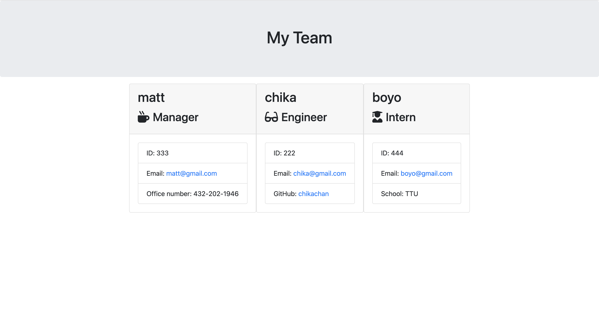

# team-profile-generator

## task

Your task is to build a Node.js command-line application that takes in information about employees on a software engineering team, then generates an HTML webpage that displays summaries for each person. Testing is key to making code maintainable, so you’ll also write a unit test for every part of your code and ensure that it passes each test.

Because this application won’t be deployed, you’ll need to provide a link to a walk-through video that demonstrates its functionality and all of the tests passing. You’ll need to add a walkthrough to the readme of your project.

## user story

AS A manager
I WANT to generate a webpage that displays my team's basic info
SO THAT I have quick access to their emails and GitHub profiles

## acceptance criteria

GIVEN a command-line application that accepts user input
WHEN I am prompted for my team members and their information
THEN an HTML file is generated that displays a nicely formatted team roster based on user input
WHEN I click on an email address in the HTML
THEN my default email program opens and populates the TO field of the email with the address
WHEN I click on the GitHub username
THEN that GitHub profile opens in a new tab
WHEN I start the application
THEN I am prompted to enter the team manager’s name, employee ID, email address, and office number
WHEN I enter the team manager’s name, employee ID, email address, and office number
THEN I am presented with a menu with the option to add an engineer or an intern or to finish building my team
WHEN I select the engineer option
THEN I am prompted to enter the engineer’s name, ID, email, and GitHub username, and I am taken back to the menu
WHEN I select the intern option
THEN I am prompted to enter the intern’s name, ID, email, and school, and I am taken back to the menu
WHEN I decide to finish building my team
THEN I exit the application, and the HTML is generated

## getting started

My application will use Jest for running the unit tests and Inquirer for collecting input from the user. The application will be invoked by using the following command:

node index.js
I started with a directory structure that looks like the following example:

__tests__/			// jest tests
  Employee.test.js
  Engineer.test.js
  Intern.test.js
  Manager.test.js
dist/               // rendered output (HTML) and CSS style sheet
lib/				// classes
src/				// template code for  html
index.js			// runs the application
This application includes Employee, Manager, Engineer, and Intern classes. The tests for these classes (in the _tests_ directory) ALL pass.

The first class is an Employee parent class with the following properties and methods:

name

id

email

getName()

getId()

getEmail()

getRole()—returns 'Employee'

The other three classes will extend Employee.

In addition to Employee's properties and methods, Manager will also have the following:

officeNumber

getRole()—overridden to return 'Manager'

In addition to Employee's properties and methods, Engineer will also have the following:

github—GitHub username

getGithub()

getRole()—overridden to return 'Engineer'

In addition to Employee's properties and methods, Intern will also have the following:

school

getSchool()

getRole()—overridden to return 'Intern'

## walkthrough video link

https://youtu.be/csL0OmM8egk
